# Thiết kế cơ sở dữ liệu — Sơ đồ thực thể liên kết (ERD)

Hệ thống gồm **18 bảng**: 14 bảng theo `Prompt.md` mục 6.1 và 4 bảng bổ sung (xem mục 5 tài liệu này).

Sơ đồ nguồn: [`erd.mmd`](erd.mmd) · Ảnh render: [`erd.png`](erd.png)

Sơ đồ chỉ hiển thị **khóa chính, khóa ngoại và 2–3 trường định danh** mỗi bảng. Danh sách trường đầy đủ nằm ở mục 5 của [`phan_tich_thiet_ke.md`](phan_tich_thiet_ke.md). Lý do: ERD 18 thực thể với toàn bộ trường sẽ không đọc nổi khi render.

---

## 1. Sơ đồ

```mermaid
erDiagram
    USERS {
        int id PK
        string username
        string password_hash
        string role
        int owner_id FK
        bool is_active
    }
    OWNERS {
        int id PK
        string full_name
        string phone
        bool is_deleted
    }
    PETS {
        int id PK
        int owner_id FK
        string name
        string species
        text ai_summary_cache
        bool is_deleted
    }
    SERVICES {
        int id PK
        string name
        string category
        decimal price
        int duration_minutes
    }
    SERVICE_PACKAGES {
        int id PK
        string name
        decimal package_price
    }
    PACKAGE_ITEMS {
        int id PK
        int package_id FK
        int service_id FK
        int quantity
    }
    SERVICE_PRICE_HISTORY {
        int id PK
        int service_id FK
        decimal old_price
        decimal new_price
        int changed_by FK
    }
    APPOINTMENTS {
        int id PK
        int pet_id FK
        int service_id FK
        int staff_id FK
        datetime scheduled_at
        datetime ends_at
        string status
        int created_by FK
    }
    APPOINTMENT_HISTORY {
        int id PK
        int appointment_id FK
        datetime old_time
        datetime new_time
        string reason
        int changed_by FK
    }
    CARE_RECORDS {
        int id PK
        int pet_id FK
        int appointment_id FK
        int staff_id FK
        date record_date
        decimal weight_at_visit
    }
    VACCINATION_SCHEDULES {
        int id PK
        int pet_id FK
        string vaccine_name
        date next_due_date
        bool is_done
    }
    INVOICES {
        int id PK
        int owner_id FK
        string invoice_number
        decimal discount_amount
        decimal total_amount
        string payment_status
        int created_by FK
    }
    INVOICE_ITEMS {
        int id PK
        int invoice_id FK
        int service_id FK
        int appointment_id FK
        int package_id FK
        decimal unit_price
        decimal line_total
    }
    PAYMENTS {
        int id PK
        int invoice_id FK
        decimal amount
        string method
        int received_by FK
    }
    AI_INTERACTION_LOGS {
        int id PK
        string feature_type
        int user_id FK
        int pet_id FK
        string model_used
        int latency_ms
        bool was_flagged
    }
    ACTIVITY_LOGS {
        int id PK
        int actor_user_id FK
        string action
        string entity_type
        int entity_id
    }
    APP_SETTINGS {
        string key PK
        string value
        int updated_by FK
    }
    NOTIFICATIONS {
        int id PK
        int pet_id FK
        int owner_id FK
        string reminder_type
        date due_date
        string channel
        string urgency
    }

    OWNERS ||--o{ USERS : "có tài khoản"
    OWNERS ||--o{ PETS : "sở hữu"
    OWNERS ||--o{ INVOICES : "nhận"
    OWNERS ||--o{ NOTIFICATIONS : "được nhắc"

    USERS ||--o{ APPOINTMENTS : "phụ trách"
    USERS ||--o{ APPOINTMENTS : "tạo lịch"
    USERS ||--o{ APPOINTMENT_HISTORY : "đổi lịch"
    USERS ||--o{ CARE_RECORDS : "ghi hồ sơ"
    USERS ||--o{ INVOICES : "lập"
    USERS ||--o{ PAYMENTS : "thu tiền"
    USERS ||--o{ SERVICE_PRICE_HISTORY : "đổi giá"
    USERS ||--o{ ACTIVITY_LOGS : "thực hiện"
    USERS ||--o{ AI_INTERACTION_LOGS : "gọi AI"
    USERS ||--o{ APP_SETTINGS : "cấu hình"

    PETS ||--o{ APPOINTMENTS : "có lịch"
    PETS ||--o{ CARE_RECORDS : "có hồ sơ"
    PETS ||--o{ VACCINATION_SCHEDULES : "có lịch tiêm"
    PETS ||--o{ NOTIFICATIONS : "sinh nhắc lịch"
    PETS ||--o{ AI_INTERACTION_LOGS : "liên quan"

    SERVICES ||--o{ APPOINTMENTS : "áp dụng"
    SERVICES ||--o{ INVOICE_ITEMS : "tính giá"
    SERVICES ||--o{ PACKAGE_ITEMS : "thuộc gói"
    SERVICES ||--o{ SERVICE_PRICE_HISTORY : "có lịch sử giá"

    SERVICE_PACKAGES ||--o{ PACKAGE_ITEMS : "gồm"
    SERVICE_PACKAGES ||--o{ INVOICE_ITEMS : "truy vết gói"

    APPOINTMENTS ||--o{ APPOINTMENT_HISTORY : "bị đổi"
    APPOINTMENTS ||--o| CARE_RECORDS : "sinh ra"
    APPOINTMENTS ||--o{ INVOICE_ITEMS : "lên hóa đơn"

    INVOICES ||--o{ INVOICE_ITEMS : "gồm"
    INVOICES ||--o{ PAYMENTS : "được thanh toán"
```

Tổng: **18 thực thể · 30 quan hệ · 30 khóa ngoại**. Mỗi khóa ngoại trong mô hình tương ứng đúng một quan hệ trên sơ đồ.

---

## 2. Sáu nhóm bảng

### 2.1. Người dùng & phân quyền — `users`, `owners`

`users` là bảng đăng nhập duy nhất cho cả 4 vai trò (`admin`, `receptionist`, `staff`, `owner`). Nhân viên có `owner_id = NULL`; chủ nuôi có `owner_id` trỏ về hồ sơ của mình trong `owners`.

Thiết kế một bảng đăng nhập thay vì tách bảng riêng cho chủ nuôi giúp chỉ có **một luồng login** và **một chỗ kiểm tra quyền**. Việc phân biệt "chủ nuôi chỉ xem dữ liệu của mình" xử lý bằng bộ lọc theo `owner_id` ở tầng nghiệp vụ, không cần bảng riêng.

`owners` dùng soft-delete: `Prompt.md` mục 3.2 yêu cầu cảnh báo khi xóa chủ nuôi còn thú cưng, lịch hẹn hay hóa đơn liên quan. Xóa cứng sẽ làm hỏng các hóa đơn cũ trỏ về chủ nuôi đó.

### 2.2. Thú cưng & chăm sóc — `pets`, `care_records`, `vaccination_schedules`

`pets` chứa hồ sơ thú cưng và **hai cột cache tóm tắt AI** (`ai_summary_cache`, `ai_summary_cached_at`). Cache có thời hạn 24 giờ và bị xóa khi có bản ghi `care_records` mới, để màn hình F5 nhiều lần không gọi lại API.

`care_records` là đầu vào chính cho chức năng tóm tắt AI. Vì vậy bảng có trường **có cấu trúc** (`record_date`, `weight_at_visit`) chứ không chỉ text tự do — nhờ đó AI so sánh được xu hướng cân nặng qua các lần khám thay vì chỉ đọc ghi chú rời rạc.

`vaccination_schedules` chỉ ở mức nhắc lịch, không phải hồ sơ y tế (`Prompt.md` mục 3.6). Bảng **chỉ lưu `is_done`**; hai trạng thái "sắp đến hạn" và "quá hạn" được tính lúc truy vấn từ `next_due_date`.

### 2.3. Danh mục dịch vụ — `services`, `service_packages`, `package_items`, `service_price_history`

`services` là danh mục dịch vụ lẻ. `service_packages` + `package_items` tạo quan hệ n-n cho combo nhiều dịch vụ với giá ưu đãi.

`service_price_history` ghi lại mọi lần đổi giá. Cùng với việc `invoice_items` chép cứng đơn giá, đây là hai cơ chế độc lập bảo vệ tính đúng đắn của hóa đơn cũ: bảng lịch sử trả lời *"giá đã từng là bao nhiêu và ai đổi"*, còn đơn giá chép cứng đảm bảo *"hóa đơn đã phát hành không bao giờ đổi số"*.

### 2.4. Lịch hẹn — `appointments`, `appointment_history`

`appointments` lưu cả `scheduled_at` và `ends_at`. `ends_at` được tính lúc tạo lịch từ `duration_minutes` của dịch vụ.

`appointment_history` ghi mọi lần đổi lịch (giờ cũ, giờ mới, lý do, người đổi). Bản ghi lịch hẹn được cập nhật tại chỗ, không tạo dòng mới — nhờ đó mỗi buổi hẹn thật luôn tương ứng đúng một dòng `appointments`.

### 2.5. Tài chính — `invoices`, `invoice_items`, `payments`

`invoices` **không có** cột `appointment_id`. Cột này nằm ở `invoice_items` để một hóa đơn gộp được nhiều lịch hẹn (`Prompt.md` mục 3.7) — xem mục 5.

`invoice_items` chép cứng `unit_price` và `line_total`, thêm `package_id` để truy vết khi dòng đó đến từ một gói dịch vụ.

`payments` cho phép nhiều dòng trên một hóa đơn, phục vụ thanh toán từng phần.

### 2.6. Hệ thống & AI — `ai_interaction_logs`, `activity_logs`, `app_settings`, `notifications`

`ai_interaction_logs` là log **kỹ thuật**: mọi lần gọi AI đều ghi lại kể cả khi lỗi, kèm `latency_ms` và `was_flagged`. Bảng này chỉ admin được xem và không chứa thông tin thanh toán.

`activity_logs` là log **nghiệp vụ**: ai làm gì, lúc nào, trên bản ghi nào.

`app_settings` lưu cấu hình sửa được lúc chạy (`ai_enabled`, `ai_model`). **API key không bao giờ lưu ở đây** — chỉ đọc từ `.env`.

`notifications` lưu tin nhắn nhắc lịch đã sinh, là dữ liệu **nghiệp vụ** (chủ nuôi xem được ở cổng tự phục vụ), khác với `ai_interaction_logs` là log kỹ thuật.

---

## 3. Ràng buộc dữ liệu bắt buộc

| # | Ràng buộc | Hậu quả nếu không có |
|---|---|---|
| 1 | `appointments.status` là enum kiểm soát ở tầng ORM, không để free text | Dữ liệu sẽ lẫn `"completed"`, `"Completed"`, `"hoàn thành"`; mọi báo cáo lọc theo trạng thái đều sai số, và quy tắc "chỉ lập hóa đơn từ lịch `completed`" mất hiệu lực |
| 2 | `invoice_items.line_total` tính và **lưu lại**, không tính runtime | Khi admin đổi giá dịch vụ, toàn bộ hóa đơn cũ sẽ tự đổi số tiền — sai lệch sổ sách và không đối chiếu được với tiền đã thu |
| 3 | `invoices.payment_status` **suy ra** từ tổng `payments`, không cho sửa tay | Trạng thái có thể ghi "đã thanh toán đủ" trong khi `payments` chưa có dòng nào; số liệu công nợ trở nên vô nghĩa |
| 4 | Mọi truy vấn `owners`/`pets` mặc định lọc `is_deleted = false` | Chủ nuôi đã xóa vẫn hiện trong danh sách chọn khi đặt lịch, và số liệu thống kê khách hàng bị đếm thừa |
| 5 | `notifications` có khóa duy nhất `(pet_id, reminder_type, due_date)` | Job nhắc lịch chạy mỗi ngày sẽ sinh một tin nhắn mới mỗi ngày cho **cùng một lịch hẹn**, chủ nuôi bị làm phiền liên tục và chi phí gọi AI tăng theo số ngày |

---

## 4. Chỉ mục đề xuất

`Prompt.md` mục 4 yêu cầu truy vấn thống kê không quét toàn bảng và API danh sách hỗ trợ phân trang. Sáu chỉ mục dưới đây phục vụ các truy vấn nóng nhất:

| Chỉ mục | Phục vụ truy vấn |
|---|---|
| `appointments(staff_id, scheduled_at)` | Kiểm tra trùng lịch — chạy mỗi lần đặt hoặc đổi lịch, là truy vấn nóng nhất hệ thống |
| `appointments(scheduled_at)` | Báo cáo lượt dịch vụ theo ngày/tuần/tháng; lọc lịch theo khoảng ngày |
| `vaccination_schedules(next_due_date)` | Job nhắc lịch hằng ngày quét các mũi sắp/đã quá hạn |
| `notifications(pet_id, reminder_type, due_date)` UNIQUE | Vừa là ràng buộc chống nhắc trùng, vừa là chỉ mục tra cứu |
| `invoices(owner_id)` | Tra cứu hóa đơn theo chủ nuôi; cổng chủ nuôi xem hóa đơn của mình |
| `invoice_items(invoice_id)` | Dựng chi tiết hóa đơn; tính tổng tiền |

---

## 5. Bốn bảng thêm so với đặc tả

`Prompt.md` mục 6.1 liệt kê 14 bảng. Thiết kế này thêm 4 bảng, **không bảng nào là chức năng mới** — mỗi bảng phục vụ một yêu cầu đã có sẵn ở phần khác của đặc tả mà mục 6.1 chưa cấp bảng để lưu.

| Bảng thêm | Yêu cầu đã có trong đặc tả | Vì sao mục 6.1 không đủ |
|---|---|---|
| `service_price_history` | Mục 3.3: *"Lịch sử thay đổi giá nên lưu (không sửa đè giá cũ trực tiếp)"* | Mục 6.1 không có bảng nào lưu được lịch sử giá; nếu chỉ sửa `services.price` thì giá cũ mất vĩnh viễn |
| `activity_logs` | Mục 4: *"Log các thao tác quan trọng (tạo/hủy lịch, thanh toán) kèm người thực hiện + thời gian"* | `appointment_history` chỉ phủ được lịch hẹn, không ghi được thao tác thanh toán |
| `app_settings` | Mục 3.1: Quản lý có quyền *"cấu hình AI (bật/tắt, chọn model)"* | Muốn admin sửa được lúc chạy thì giá trị phải nằm trong CSDL; để trong `.env` thì phải khởi động lại ứng dụng mới đổi được |
| `notifications` | Mục 7.3 bước 2: *"sinh tin nhắn → lưu vào `ai_interaction_logs` → (mô phỏng) gửi qua kênh thông báo"* và mục 3.1: chủ nuôi *"nhận tin nhắn nhắc lịch"* | `ai_interaction_logs` là log kỹ thuật; dùng nó làm nơi chủ nuôi đọc tin nhắn sẽ trộn lẫn dữ liệu gỡ lỗi với dữ liệu nghiệp vụ, và không có chỗ lưu trạng thái đã gửi |
