# KT1 — Tài liệu Phân tích & Thiết kế: Kế hoạch triển khai

> **For agentic workers:** REQUIRED SUB-SKILL: Use superpowers:subagent-driven-development (recommended) or superpowers:executing-plans to implement this plan task-by-task. Steps use checkbox (`- [ ]`) syntax for tracking.

**Goal:** Sinh đầy đủ bộ tài liệu phân tích-thiết kế nộp mốc KT1, phủ hết 10 tiêu chí rubric KT1, kèm khung thư mục dự án và `.env.example`.

**Architecture:** Đây là mốc tài liệu, không viết mã Python nghiệp vụ. Nguồn nội dung duy nhất là `docs/superpowers/specs/2026-08-02-pet-care-system-design.md` (đã duyệt) và `Prompt.md` (đặc tả gốc). Mỗi tài liệu là một task độc lập, kết thúc bằng một commit riêng.

**Tech Stack:** Markdown, Mermaid (ERD + use case). Không cài thư viện nào ở mốc này.

## Global Constraints

- **Ngôn ngữ:** toàn bộ tài liệu viết bằng tiếng Việt.
- **Nguồn sự thật:** mọi con số, tên bảng, tên trường, tên biến môi trường phải khớp **nguyên văn** với spec `docs/superpowers/specs/2026-08-02-pet-care-system-design.md`. Nếu phát hiện spec sai, dừng lại và báo, không tự sửa lệch.
- **18 bảng.** Không thêm, không bớt. Tên bảng và tên trường viết `snake_case` đúng như spec mục 3.1.
- **4 role:** `admin`, `receptionist`, `staff`, `owner`.
- **Không mở rộng phạm vi.** Không thêm chức năng, bảng, hay use case không có trong `Prompt.md` mục 3/5 hoặc spec. Đặc tả mục 1 cấm feature creep.
- **Không viết mã nghiệp vụ ở mốc này.** Chỉ tạo thư mục rỗng, `.env.example`, `requirements.txt`.
- **Tuyệt đối không tạo file `.env` thật.** Chỉ `.env.example` với giá trị giả.
- **Mỗi task kết thúc bằng 1 commit** với message tiếng Việt mô tả sản phẩm, kết thúc bằng dòng `Co-Authored-By: Claude Opus 5 (1M context) <noreply@anthropic.com>`.
- **Thư mục làm việc:** `C:\vscode\he_thong_quan_ly_thu_cung_va_lich_cham_soc_co_tich_hop_AI` (đã là git repo, commit gốc `982a724`).

**Ghi chú về cách áp dụng writing-plans cho mốc tài liệu:** skill writing-plans mặc định giả định vòng lặp TDD cho mã nguồn. Mốc KT1 không có mã để test, nên "bước kiểm chứng" của mỗi task là một **checklist đối chiếu cụ thể, đếm được** (đếm thực thể, đối chiếu từng dòng bảng đặc tả, đối chiếu 10 tiêu chí rubric) thay vì lệnh `pytest`. Từ KT2 trở đi, khi có mã, kế hoạch sẽ quay lại đúng vòng TDD.

---

## File Structure

| File | Trách nhiệm | Task |
|---|---|---|
| `backend/`, `frontend/`, `database/` (khung rỗng) | Cây thư mục theo spec mục 2.3 | 1 |
| `backend/.env.example` | 12 biến môi trường, giá trị giả | 1 |
| `backend/requirements.txt` | Danh sách thư viện dự kiến KT2 | 1 |
| `docs/erd.mmd` | Sơ đồ ERD Mermaid 18 thực thể | 2 |
| `docs/erd.md` | Giải thích ERD, ràng buộc, chỉ mục | 2 |
| `docs/use_case.md` | 5 actor + use case mục 5 + sơ đồ + đặc tả 4 use case chính | 3 |
| `docs/phan_tich_thiet_ke.md` | Tài liệu PTTK chính — mục 3–7 đặc tả + bảng sai khác | 4 |
| `docs/ai_prompt_log.md` | Nhật ký sử dụng AI, điền sẵn phiên KT1 | 5 |
| `README.md` | Giới thiệu, cài đặt, chạy, cấu trúc, lộ trình | 6 |
| `docs/test_report.md` | Khung rỗng có sẵn bảng, điền ở KT3 | 6 |
| `docs/final_report.md` | Khung rỗng có sẵn mục lục, điền ở Cuối kỳ | 6 |
| `docs/rubric_kt1.md` | Bảng đối chiếu 10 tiêu chí KT1 → vị trí trong tài liệu | 7 |

---

### Task 1: Khung thư mục, `.env.example`, `requirements.txt`

**Files:**
- Create: `backend/app/models/.gitkeep`, `backend/app/services/.gitkeep`, `backend/app/routers/.gitkeep`, `backend/app/auth/.gitkeep`, `backend/app/schemas/.gitkeep`, `backend/app/ai/prompts/.gitkeep`, `backend/app/ai/providers/.gitkeep`, `backend/tests/.gitkeep`, `frontend/templates/.gitkeep`, `frontend/static/.gitkeep`, `database/.gitkeep`
- Create: `backend/.env.example`
- Create: `backend/requirements.txt`

**Interfaces:**
- Produces: cây thư mục mà `README.md` (Task 6) và `docs/phan_tich_thiet_ke.md` (Task 4) sẽ mô tả; tên 12 biến môi trường mà Task 4 và Task 6 trích dẫn lại.

- [ ] **Step 1: Tạo cây thư mục rỗng**

Tạo đúng 11 file `.gitkeep` liệt kê ở trên (git không theo dõi thư mục rỗng). Cây kết quả phải khớp spec mục 2.3.

- [ ] **Step 2: Viết `backend/.env.example`**

Chép nguyên văn khối sau (nguồn: spec mục 2.4):

```
# Database
DATABASE_URL=sqlite:///./pet_care.db

# AI Engine — API key CHỈ ở đây, không bao giờ vào DB, không commit .env thật
AI_PROVIDER=gemini
GEMINI_API_KEY=your_key_here
AI_MODEL=gemini-1.5-flash        # kiểm tra tên model mới nhất khi triển khai KT3
AI_TIMEOUT_SECONDS=15
AI_RETRY_TIMEOUT_SECONDS=8

# App
SECRET_KEY=change_me
JWT_EXPIRE_MINUTES=60            # dùng cho PERMANENT_SESSION_LIFETIME

# Nhắc lịch
REMINDER_APPOINTMENT_DAYS=2      # quét lịch hẹn trong N ngày tới
VACCINE_DUE_SOON_DAYS=7          # ngưỡng "sắp đến hạn" của lịch tiêm
REMINDER_JOB_HOUR=7              # giờ chạy job hằng ngày
REMINDER_MAX_PER_RUN=50          # trần số lần gọi AI mỗi lần chạy, tránh rate limit
```

- [ ] **Step 3: Viết `backend/requirements.txt`**

Không ghim phiên bản cụ thể ở mốc này (phiên bản chốt khi cài thật ở KT2):

```
Flask
Flask-SQLAlchemy
python-dotenv
bcrypt
APScheduler
google-generativeai
pytest
```

- [ ] **Step 4: Kiểm chứng**

Chạy và đối chiếu:

```powershell
Get-ChildItem -Recurse -Force -Filter ".gitkeep" | Measure-Object | Select-Object Count
```
Kỳ vọng: `Count = 11`.

```powershell
Get-Content backend\.env.example | Select-String -Pattern "^[A-Z_]+=" | Measure-Object | Select-Object Count
```
Kỳ vọng: `Count = 12`.

```powershell
Test-Path backend\.env
```
Kỳ vọng: `False` — nếu `True` thì đã tạo nhầm file `.env` thật, phải xóa ngay.

- [ ] **Step 5: Commit**

```powershell
git add -A
git commit -m @'
chore: dựng khung thư mục dự án và .env.example

Cây thư mục theo spec mục 2.3: backend/app/{models,services,routers,
auth,schemas,ai}, frontend/{templates,static}, database/.

.env.example gồm 12 biến, API key chỉ để giá trị giả. requirements.txt
liệt kê thư viện dự kiến, chưa ghim phiên bản.

Co-Authored-By: Claude Opus 5 (1M context) <noreply@anthropic.com>
'@
```

---

### Task 2: ERD — `docs/erd.mmd` + `docs/erd.md`

**Files:**
- Create: `docs/erd.mmd`
- Create: `docs/erd.md`

**Interfaces:**
- Consumes: danh sách 18 bảng và trường ở spec mục 3.1.
- Produces: `docs/erd.mmd` mà `docs/phan_tich_thiet_ke.md` (Task 4) sẽ nhúng lại hoặc dẫn chiếu.

**Quyết định trình bày:** `erd.mmd` chỉ hiện **khóa chính, khóa ngoại và 2–3 trường định danh** mỗi thực thể. Danh sách trường đầy đủ nằm ở bảng trong `docs/phan_tich_thiet_ke.md`. Lý do: ERD 18 thực thể với toàn bộ trường sẽ không đọc nổi khi render.

**Quan hệ với sơ đồ ở spec mục 3.2:** sơ đồ trong spec là bản **tổng quan** 24 quan hệ, lược bỏ các khóa ngoại kiểm toán (`created_by`, `changed_by`, `updated_by`, `received_by`). `erd.mmd` là bản **đầy đủ** 30 quan hệ, vẽ cả các khóa ngoại đó để mỗi FK trong mô hình đều truy được về một quan hệ. Hai bản không mâu thuẫn; `erd.mmd` là bản dùng cho tài liệu nộp.

- [ ] **Step 1: Viết `docs/erd.mmd`**

Chép nguyên văn:

```mermaid
erDiagram
    USERS {
        int id PK
        string username
        string password_hash
        string role
        int owner_id FK
        bool is_active
    }
    OWNERS {
        int id PK
        string full_name
        string phone
        bool is_deleted
    }
    PETS {
        int id PK
        int owner_id FK
        string name
        string species
        text ai_summary_cache
        bool is_deleted
    }
    SERVICES {
        int id PK
        string name
        string category
        decimal price
        int duration_minutes
    }
    SERVICE_PACKAGES {
        int id PK
        string name
        decimal package_price
    }
    PACKAGE_ITEMS {
        int id PK
        int package_id FK
        int service_id FK
        int quantity
    }
    SERVICE_PRICE_HISTORY {
        int id PK
        int service_id FK
        decimal old_price
        decimal new_price
        int changed_by FK
    }
    APPOINTMENTS {
        int id PK
        int pet_id FK
        int service_id FK
        int staff_id FK
        datetime scheduled_at
        datetime ends_at
        string status
        int created_by FK
    }
    APPOINTMENT_HISTORY {
        int id PK
        int appointment_id FK
        datetime old_time
        datetime new_time
        string reason
        int changed_by FK
    }
    CARE_RECORDS {
        int id PK
        int pet_id FK
        int appointment_id FK
        int staff_id FK
        date record_date
        decimal weight_at_visit
    }
    VACCINATION_SCHEDULES {
        int id PK
        int pet_id FK
        string vaccine_name
        date next_due_date
        bool is_done
    }
    INVOICES {
        int id PK
        int owner_id FK
        string invoice_number
        decimal discount_amount
        decimal total_amount
        string payment_status
        int created_by FK
    }
    INVOICE_ITEMS {
        int id PK
        int invoice_id FK
        int service_id FK
        int appointment_id FK
        int package_id FK
        decimal unit_price
        decimal line_total
    }
    PAYMENTS {
        int id PK
        int invoice_id FK
        decimal amount
        string method
        int received_by FK
    }
    AI_INTERACTION_LOGS {
        int id PK
        string feature_type
        int user_id FK
        int pet_id FK
        string model_used
        int latency_ms
        bool was_flagged
    }
    ACTIVITY_LOGS {
        int id PK
        int actor_user_id FK
        string action
        string entity_type
        int entity_id
    }
    APP_SETTINGS {
        string key PK
        string value
        int updated_by FK
    }
    NOTIFICATIONS {
        int id PK
        int pet_id FK
        int owner_id FK
        string reminder_type
        date due_date
        string channel
        string urgency
    }

    OWNERS ||--o{ USERS : "có tài khoản"
    OWNERS ||--o{ PETS : "sở hữu"
    OWNERS ||--o{ INVOICES : "nhận"
    OWNERS ||--o{ NOTIFICATIONS : "được nhắc"

    USERS ||--o{ APPOINTMENTS : "phụ trách"
    USERS ||--o{ APPOINTMENTS : "tạo lịch"
    USERS ||--o{ APPOINTMENT_HISTORY : "đổi lịch"
    USERS ||--o{ CARE_RECORDS : "ghi hồ sơ"
    USERS ||--o{ INVOICES : "lập"
    USERS ||--o{ PAYMENTS : "thu tiền"
    USERS ||--o{ SERVICE_PRICE_HISTORY : "đổi giá"
    USERS ||--o{ ACTIVITY_LOGS : "thực hiện"
    USERS ||--o{ AI_INTERACTION_LOGS : "gọi AI"
    USERS ||--o{ APP_SETTINGS : "cấu hình"

    PETS ||--o{ APPOINTMENTS : "có lịch"
    PETS ||--o{ CARE_RECORDS : "có hồ sơ"
    PETS ||--o{ VACCINATION_SCHEDULES : "có lịch tiêm"
    PETS ||--o{ NOTIFICATIONS : "sinh nhắc lịch"
    PETS ||--o{ AI_INTERACTION_LOGS : "liên quan"

    SERVICES ||--o{ APPOINTMENTS : "áp dụng"
    SERVICES ||--o{ INVOICE_ITEMS : "tính giá"
    SERVICES ||--o{ PACKAGE_ITEMS : "thuộc gói"
    SERVICES ||--o{ SERVICE_PRICE_HISTORY : "có lịch sử giá"

    SERVICE_PACKAGES ||--o{ PACKAGE_ITEMS : "gồm"
    SERVICE_PACKAGES ||--o{ INVOICE_ITEMS : "truy vết gói"

    APPOINTMENTS ||--o{ APPOINTMENT_HISTORY : "bị đổi"
    APPOINTMENTS ||--o| CARE_RECORDS : "sinh ra"
    APPOINTMENTS ||--o{ INVOICE_ITEMS : "lên hóa đơn"

    INVOICES ||--o{ INVOICE_ITEMS : "gồm"
    INVOICES ||--o{ PAYMENTS : "được thanh toán"
```



- [ ] **Step 2: Viết `docs/erd.md`**

Cấu trúc bắt buộc, mỗi mục là một `##`:

1. **Sơ đồ** — nhúng lại khối mermaid ở Step 1 trong code fence ```` ```mermaid ````.
2. **Nhóm bảng** — chia 18 bảng thành 5 nhóm và giải thích vai trò từng nhóm: *Người dùng & phân quyền* (users, owners), *Thú cưng & chăm sóc* (pets, care_records, vaccination_schedules), *Danh mục dịch vụ* (services, service_packages, package_items, service_price_history), *Lịch hẹn* (appointments, appointment_history), *Tài chính* (invoices, invoice_items, payments), *Hệ thống & AI* (ai_interaction_logs, activity_logs, app_settings, notifications).
3. **Ràng buộc dữ liệu** — chép 5 ràng buộc ở spec mục 3.3, mỗi ràng buộc thêm 1 câu giải thích *hậu quả nếu không có*.
4. **Chỉ mục đề xuất** — liệt kê và giải thích: `appointments(staff_id, scheduled_at)` cho truy vấn chống trùng lịch; `appointments(scheduled_at)` cho báo cáo theo thời gian; `vaccination_schedules(next_due_date)` cho job nhắc lịch; `notifications(pet_id, reminder_type, due_date)` UNIQUE cho chống nhắc trùng; `invoices(owner_id)`, `invoice_items(invoice_id)` cho tra cứu hóa đơn.
5. **Bốn bảng thêm so với đặc tả** — bảng 4 dòng: tên bảng · mục đặc tả yêu cầu · lý do mục 6.1 thiếu. Nguồn: spec mục 7 dòng ③⑤⑧⑨.

- [ ] **Step 3: Kiểm chứng**

Đếm số thực thể khai báo trong `erd.mmd`:
```powershell
Get-Content docs\erd.mmd | Select-String -Pattern "^\s{4}[A-Z_]+\s\{" | Measure-Object | Select-Object Count
```
Kỳ vọng: `Count = 18`.

Đếm số dòng quan hệ:
```powershell
Get-Content docs\erd.mmd | Select-String -Pattern "\|\|--o" | Measure-Object | Select-Object Count
```
Kỳ vọng: `Count = 30`.

Đối chiếu thủ công: mở https://mermaid.live, dán nội dung `erd.mmd`, xác nhận render ra sơ đồ không báo lỗi cú pháp. Chụp ảnh lưu `docs/erd.png` (mục 11.3 yêu cầu "ảnh render").

Đối chiếu từng khóa ngoại: với mỗi trường có hậu tố `FK` trong `erd.mmd`, xác nhận tồn tại đúng một dòng quan hệ tương ứng. Tổng số trường `FK` phải bằng 30.

- [ ] **Step 4: Commit**

```powershell
git add -A
git commit -m @'
docs: thêm ERD 18 bảng (erd.mmd, erd.md, erd.png)

Sơ đồ Mermaid 18 thực thể, 30 quan hệ. erd.md giải thích 5 nhóm bảng,
5 ràng buộc dữ liệu kèm hậu quả nếu thiếu, 6 chỉ mục đề xuất, và 4
bảng thêm so với mục 6.1 đặc tả kèm lý do.

Co-Authored-By: Claude Opus 5 (1M context) <noreply@anthropic.com>
'@
```

---

### Task 3: `docs/use_case.md`

**Files:**
- Create: `docs/use_case.md`

**Interfaces:**
- Consumes: bảng actor/use case ở `Prompt.md` mục 5; ma trận quyền ở spec mục 4.2.
- Produces: danh sách use case mà `docs/phan_tich_thiet_ke.md` (Task 4) dẫn chiếu.

**Ràng buộc cứng:** `Prompt.md` mục 5 ghi rõ *"tránh vẽ thêm use case chưa có trong đặc tả"*. Danh sách use case lấy **đúng** bảng mục 5, không thêm.

- [ ] **Step 1: Viết phần actor**

5 actor: Quản lý (Admin), Lễ tân (Receptionist), Nhân viên chăm sóc (Groomer/Staff), Hệ thống (Scheduler), Chủ nuôi (Owner). Mỗi actor 1 đoạn: vai trò, quyền chính, ghi chú.

Với Chủ nuôi ghi rõ: **có cổng tự phục vụ** (quyết định spec mục 1), quyền chỉ đọc, không tự đặt lịch (spec mục 4.2).

- [ ] **Step 2: Viết sơ đồ use case bằng Mermaid**

Dùng `flowchart LR` với subgraph cho hệ thống, node actor ở ngoài. Use case lấy đúng mục 5:

- Quản lý: Quản lý tài khoản & phân quyền · Cấu hình dịch vụ/giá · Xem báo cáo doanh thu · Cấu hình AI
- Lễ tân: Quản lý chủ nuôi/thú cưng · Đặt/đổi/hủy lịch · Lập hóa đơn · Ghi nhận thanh toán · Xem nhắc tiêm sắp đến hạn
- Nhân viên chăm sóc: Xem lịch của mình · Ghi hồ sơ chăm sóc · Xem tóm tắt AI hồ sơ thú cưng
- Hệ thống (Scheduler): Quét lịch/tiêm sắp đến hạn · Gọi AI sinh tin nhắn nhắc · Gửi qua kênh thông báo
- Chủ nuôi: Nhận tin nhắn nhắc lịch · Đặt câu hỏi chăm sóc cho AI · Xem lịch thú cưng của mình

- [ ] **Step 3: Đặc tả chi tiết 4 use case chính**

Mỗi use case một bảng với các hàng: Mã · Tên · Actor chính · Tiền điều kiện · Luồng chính (đánh số bước) · Luồng thay thế · Hậu điều kiện · Quy tắc nghiệp vụ.

Bốn use case bắt buộc đặc tả (chọn vì đây là các luồng có ràng buộc phức tạp nhất, và đều có ca test tương ứng ở `Prompt.md` mục 10):

| Mã | Tên | Quy tắc nghiệp vụ phải nêu (nguồn spec) |
|---|---|---|
| UC-01 | Đặt lịch hẹn | Tính `ends_at`; chặn trùng khi cùng `staff_id`, status ∈ {pending, confirmed}, `new_start < old_end AND old_start < new_end`; lịch không gán nhân viên thì không kiểm tra (spec mục 4.3) |
| UC-02 | Đổi lịch hẹn | Đổi tại chỗ, ghi `appointment_history`, status quay về `pending`, kiểm tra chống trùng lại với giờ mới (spec mục 4.3) |
| UC-03 | Lập hóa đơn | Chỉ từ lịch hẹn `completed`; mỗi lịch hẹn chỉ lên hóa đơn một lần; `unit_price` chép cứng; gói dịch vụ bung thành dòng con theo công thức spec mục 4.4 |
| UC-04 | Hỏi đáp AI chăm sóc | Guardrail 2 tầng; `disclaimer_vi` là hằng số trong code; ép `should_see_vet = true` khi khớp từ khóa rủi ro; fallback khi AI lỗi (spec mục 5.4) |

- [ ] **Step 4: Kiểm chứng**

Mở `Prompt.md` mục 5, đối chiếu **từng ô** trong cột "Use case" với `docs/use_case.md`:
- Mỗi use case trong `Prompt.md` mục 5 xuất hiện đúng một lần trong tài liệu → không thiếu.
- Mỗi use case trong tài liệu truy được về một ô trong `Prompt.md` mục 5, **trừ** "Xem lịch thú cưng của mình" (đến từ mục 3.1 vì giữ cổng chủ nuôi — ghi chú nguồn ngay tại chỗ) → không thừa.

Kiểm tra sơ đồ Mermaid render được trên https://mermaid.live.

- [ ] **Step 5: Commit**

```powershell
git add -A
git commit -m @'
docs: thêm tài liệu use case (5 actor, sơ đồ, 4 UC đặc tả chi tiết)

Danh sách use case lấy đúng bảng mục 5 đặc tả, không vẽ thêm. Bổ sung
duy nhất "Xem lịch thú cưng của mình" từ mục 3.1 do giữ cổng chủ nuôi,
có ghi chú nguồn.

Đặc tả chi tiết UC-01 đặt lịch, UC-02 đổi lịch, UC-03 lập hóa đơn,
UC-04 hỏi đáp AI — bốn luồng có ràng buộc phức tạp nhất và đều có ca
test tương ứng ở mục 10.

Co-Authored-By: Claude Opus 5 (1M context) <noreply@anthropic.com>
'@
```

---

### Task 4: `docs/phan_tich_thiet_ke.md`

**Files:**
- Create: `docs/phan_tich_thiet_ke.md`

**Interfaces:**
- Consumes: toàn bộ spec; `docs/erd.mmd` (Task 2); `docs/use_case.md` (Task 3); `backend/.env.example` (Task 1).
- Produces: tài liệu chính mà `docs/rubric_kt1.md` (Task 7) đối chiếu.

Đây là tài liệu lớn nhất của KT1. Cấu trúc 9 mục `##`, mỗi mục có nguồn xác định:

- [ ] **Step 1: Mục 1 — Tổng quan bài toán**
Nguồn `Prompt.md` mục 2. Nêu bối cảnh cửa hàng dịch vụ thú cưng, phạm vi hệ thống, và **nguyên tắc xuyên suốt**: AI là lớp hỗ trợ, không phải nghiệp vụ lõi. Kết thúc bằng bảng "Trong phạm vi / Ngoài phạm vi" lấy từ spec mục 1.

- [ ] **Step 2: Mục 2 — Yêu cầu chức năng**
Nguồn `Prompt.md` mục 3.1–3.8, cập nhật theo quyết định đã chốt. Mỗi tiểu mục 3.x thành một `###`. Nêu rõ ở 3.1: giữ cổng chủ nuôi; ở 3.3: giữ gói dịch vụ.

- [ ] **Step 3: Mục 3 — Yêu cầu phi chức năng**
Nguồn `Prompt.md` mục 4, giữ nguyên 6 nhóm (bảo mật, hiệu năng, khả dụng, sao lưu, trải nghiệm, nhật ký hệ thống). Với mỗi nhóm bổ sung **cách hiện thực cụ thể** trong thiết kế này, ví dụ: khả dụng → `services/` không import `ai/` (spec mục 2.1); nhật ký hệ thống → bảng `activity_logs`.

- [ ] **Step 4: Mục 4 — Actor & use case**
Tóm tắt 5 actor, dẫn chiếu `docs/use_case.md` cho chi tiết. Nhúng ma trận quyền 13 dòng từ spec mục 4.2 nguyên vẹn.

- [ ] **Step 5: Mục 5 — Thiết kế cơ sở dữ liệu**
Nhúng bảng 18 dòng từ spec mục 3.1 (cột: STT · bảng · trường chính · ghi chú thiết kế). Nhúng sơ đồ ERD từ `docs/erd.mmd`. Chép 5 ràng buộc bắt buộc từ spec mục 3.3.

- [ ] **Step 6: Mục 6 — Kiến trúc hệ thống**
Nguồn spec mục 2. Gồm: 3 nguyên tắc nền (mục 2.1), bảng stack (mục 2.2), cây thư mục (mục 2.3), bảng biến môi trường (mục 2.4). Nêu rõ **chiều phụ thuộc một hướng** `services/ ↛ ai/` và giải thích tại sao đó là bằng chứng kiểm chứng được cho yêu cầu khả dụng.

- [ ] **Step 7: Mục 7 — Vị trí và thiết kế lớp AI**
Nguồn spec mục 5 + `Prompt.md` mục 8. Gồm: sơ đồ 5 luồng dữ liệu (`Prompt.md` mục 7.3); ba chức năng AI kèm system prompt, user prompt template, output schema JSON (chép nguyên văn `Prompt.md` mục 8.1–8.3); bảng xử lý lỗi 5 dòng (spec mục 5.2); guardrail 2 tầng (spec mục 5.4); riêng tư (spec mục 5.5).

- [ ] **Step 8: Mục 8 — Kế hoạch kiểm thử**
Nguồn spec mục 6. Bảng 7 file test và ca phủ. Nêu rõ nguyên tắc **test AI dùng mock, không gọi API thật** kèm 3 lý do.

- [ ] **Step 9: Mục 9 — Sai khác so với đặc tả gốc**
Chép nguyên vẹn bảng 10 dòng từ spec mục 7 (cột: # · sai khác · đặc tả gốc · thiết kế này · lý do). **Đây là mục quan trọng nhất khi bảo vệ** — mỗi dòng phải trả lời được câu hỏi "tại sao không làm đúng đề bài".

- [ ] **Step 10: Kiểm chứng**

Kiểm tra cấu trúc:
```powershell
Get-Content docs\phan_tich_thiet_ke.md | Select-String -Pattern "^## " | Measure-Object | Select-Object Count
```
Kỳ vọng: `Count = 9`.

Đối chiếu nội dung — với mỗi mục dưới đây, xác nhận có nội dung tương ứng trong tài liệu:
- `Prompt.md` mục 2 → Mục 1
- `Prompt.md` mục 3.1 đến 3.8 (8 tiểu mục) → Mục 2 có đủ 8 `###`
- `Prompt.md` mục 4 (6 nhóm) → Mục 3 có đủ 6 nhóm
- `Prompt.md` mục 5 → Mục 4
- `Prompt.md` mục 6 → Mục 5, bảng có đúng 18 dòng
- `Prompt.md` mục 7 → Mục 6
- `Prompt.md` mục 8.1/8.2/8.3 → Mục 7 có đủ 3 chức năng, mỗi chức năng có system prompt + user template + output schema
- spec mục 7 → Mục 9, bảng có đúng 10 dòng

Quét placeholder:
```powershell
Select-String -Path docs\*.md -Pattern "TBD|TODO|\[điền|chưa rõ"
```
Kỳ vọng: không có kết quả.

- [ ] **Step 11: Commit**

```powershell
git add -A
git commit -m @'
docs: thêm tài liệu phân tích thiết kế (9 mục, nguồn mục 2-8 đặc tả)

Phủ toàn bộ mục 2-8 của Prompt.md: tổng quan, chức năng 3.1-3.8, phi
chức năng, actor/use case kèm ma trận quyền 4 role, CSDL 18 bảng, kiến
trúc, lớp AI với 3 chức năng và guardrail, kế hoạch kiểm thử.

Mục 9 liệt kê 10 sai khác so với đặc tả gốc kèm lý do, phục vụ trả lời
câu hỏi khi bảo vệ.

Co-Authored-By: Claude Opus 5 (1M context) <noreply@anthropic.com>
'@
```

---

### Task 5: `docs/ai_prompt_log.md`

**Files:**
- Create: `docs/ai_prompt_log.md`

**Interfaces:**
- Consumes: lịch sử phiên brainstorm ngày 2026-08-02 (đã tóm tắt ở spec mục 9).
- Produces: file nhật ký được cập nhật liên tục qua KT2, KT3, Cuối kỳ.

**Đây là tiêu chí rubric KT1#9.** `Prompt.md` mục 1 ghi rõ đây là *minh chứng bắt buộc chấm điểm*.

- [ ] **Step 1: Viết phần mở đầu**

Giải thích mục đích file, quy ước ghi (ghi ngay sau mỗi lần dùng AI, không ghi hồi tố), và ý nghĩa 7 cột theo mẫu `Prompt.md` mục 11.2.

- [ ] **Step 2: Viết bảng nhật ký với các dòng của phiên KT1**

Bảng 7 cột: Ngày · Giai đoạn · Mục đích · Prompt (rút gọn) · Phản hồi AI (tóm tắt) · Đã kiểm chứng/chỉnh sửa · Người thực hiện.

Điền tối thiểu 5 dòng, tất cả ngày `2026-08-02`, giai đoạn `KT1`:

1. *Mục đích:* Phân tích đặc tả, xác định phạm vi tùy chọn. *Kiểm chứng:* sinh viên chốt **giữ cả** cổng chủ nuôi và gói dịch vụ, **ngược** với khuyến nghị bỏ cả hai của AI.
2. *Mục đích:* Chọn stack frontend. *Kiểm chứng:* sinh viên đổi lựa chọn 3 lần (hybrid → yêu cầu so sánh lại React SPA → chốt Jinja2 toàn bộ) sau khi AI phân tích chi phí từng phương án.
3. *Mục đích:* Kiểm tra cây thư mục có buộc phải lệch mục 7.2 không. *Kiểm chứng:* AI đề xuất bỏ tầng `backend/frontend`, sinh viên phản đối vì muốn bám đặc tả; AI đưa phương án giữ nguyên cây 7.2 với `frontend/` chứa templates + static — **phương án này chỉ có được nhờ sinh viên phản đối**.
4. *Mục đích:* Rà soát mô hình dữ liệu mục 6.1. *Phản hồi:* AI phát hiện **mâu thuẫn trong đặc tả gốc** — mục 3.7 yêu cầu gộp nhiều lịch hẹn vào một hóa đơn nhưng mục 6.1 chỉ cho `invoices.appointment_id` quan hệ 1-1. *Kiểm chứng:* sinh viên duyệt phương án chuyển `appointment_id` xuống `invoice_items`.
5. *Mục đích:* Tự rà soát spec sau khi viết. *Phản hồi:* AI tự phát hiện đã **đếm sai** số bảng mục 6.1 (nói 13, thực tế 14), công thức chia giá gói mơ hồ khi `quantity > 1`, và một quan hệ ERD bị ngược chiều. *Kiểm chứng:* đã sửa cả 3 trước khi commit.

Mỗi dòng cột "Prompt (rút gọn)" ghi 1–2 câu, không chép nguyên văn hàng nghìn ký tự.

- [ ] **Step 3: Kiểm chứng**

```powershell
Get-Content docs\ai_prompt_log.md | Select-String -Pattern "^\| 2026-" | Measure-Object | Select-Object Count
```
Kỳ vọng: `Count ≥ 5`.

Kiểm tra chất lượng minh chứng — với mỗi dòng, cột "Đã kiểm chứng/chỉnh sửa" phải mô tả một **hành động cụ thể của sinh viên**, không được để trống hay ghi "đã kiểm tra". Ít nhất 2 dòng phải cho thấy sinh viên **bác bỏ hoặc sửa** đề xuất của AI — đây là thứ phân biệt "dùng AI có kiểm soát" với "copy nguyên output".

- [ ] **Step 4: Commit**

```powershell
git add -A
git commit -m @'
docs: khởi tạo nhật ký sử dụng AI với 5 dòng của phiên KT1

Theo mẫu 7 cột mục 11.2 đặc tả. Ghi lại quá trình phân tích đặc tả,
chọn stack, rà soát mô hình dữ liệu.

Ba dòng ghi nhận sinh viên bác bỏ hoặc sửa đề xuất của AI, một dòng ghi
AI phát hiện mâu thuẫn trong đặc tả gốc, một dòng ghi AI tự phát hiện
lỗi của chính mình khi rà soát.

Co-Authored-By: Claude Opus 5 (1M context) <noreply@anthropic.com>
'@
```

---

### Task 6: `README.md` + khung `test_report.md` + khung `final_report.md`

**Files:**
- Create: `README.md`
- Create: `docs/test_report.md`
- Create: `docs/final_report.md`

**Interfaces:**
- Consumes: cây thư mục và `.env.example` (Task 1); bảng 7 file test ở spec mục 6.
- Produces: `docs/test_report.md` mà KT3 sẽ điền; `docs/final_report.md` mà Cuối kỳ sẽ điền.

- [ ] **Step 1: Viết `README.md`**

Cấu trúc 7 mục `##`:
1. **Giới thiệu** — tên đồ án, môn học, mô tả 3–4 câu, nguyên tắc "AI là lớp hỗ trợ".
2. **Tính năng** — liệt kê theo 2 nhóm: nghiệp vụ quản lý (7 nhóm chức năng mục 3.2–3.8) và AI (3 chức năng mục 8).
3. **Công nghệ** — bảng stack từ spec mục 2.2.
4. **Cấu trúc thư mục** — cây từ spec mục 2.3 kèm chú thích một dòng mỗi thư mục.
5. **Cài đặt & chạy** — các bước: tạo venv, `pip install -r backend/requirements.txt`, copy `.env.example` → `.env` và điền `GEMINI_API_KEY`, khởi tạo CSDL, nạp `database/seed_data.sql`, chạy app. **Ghi rõ trạng thái: các bước này áp dụng từ KT2 khi đã có mã nguồn.**
6. **Tài liệu** — bảng liên kết tới 7 file trong `docs/` kèm mô tả một dòng.
7. **Lộ trình** — bảng 4 mốc từ spec mục 8, đánh dấu KT1 đã xong.

Mục 5 phải có cảnh báo: **không commit file `.env` thật** (`Prompt.md` mục 9).

- [ ] **Step 2: Viết khung `docs/test_report.md`**

Phần mở đầu giải thích quy ước ghi kết quả (mỗi lần chạy ghi ngày, người test, môi trường). Sau đó **bảng đã điền sẵn cột "Chức năng", "Ca kiểm thử", "Kỳ vọng"** cho toàn bộ 9 dòng ở `Prompt.md` mục 10, cộng 3 ca bổ sung ở spec mục 6 (lập hóa đơn 2 lần cho cùng lịch hẹn; chủ nuôi A đổi `pet_id` sang thú cưng nhà B; đổi lịch ghi đúng `appointment_history`). Hai cột "Kết quả (pass/fail)" và "Ngày test" **để trống** — điền ở KT3.

Đây không phải placeholder vi phạm: bảng có đủ nội dung, chỉ hai cột kết quả chưa có dữ liệu vì chưa chạy test. Ghi chú rõ điều đó ở đầu file.

- [ ] **Step 3: Viết khung `docs/final_report.md`**

Chỉ mục lục 10 chương ứng với 10 tiêu chí rubric Cuối kỳ (`Prompt.md` mục 13), mỗi chương một dòng mô tả nội dung sẽ viết và nguồn lấy từ đâu. Ghi ở đầu file: *"Khung tài liệu, nội dung viết ở mốc Cuối kỳ."*

- [ ] **Step 4: Kiểm chứng**

```powershell
Get-Content README.md | Select-String -Pattern "^## " | Measure-Object | Select-Object Count
```
Kỳ vọng: `Count = 7`.

```powershell
Get-Content docs\test_report.md | Select-String -Pattern "^\| " | Measure-Object | Select-Object Count
```
Kỳ vọng: `Count ≥ 14` (1 dòng tiêu đề + 1 dòng phân cách + 12 ca kiểm thử).

Đối chiếu: mở `README.md` mục 6, xác nhận **mỗi file trong `docs/`** đều có một dòng trong bảng, và mỗi liên kết trỏ tới file thực sự tồn tại.

- [ ] **Step 5: Commit**

```powershell
git add -A
git commit -m @'
docs: thêm README và khung báo cáo kiểm thử, báo cáo cuối kỳ

README 7 mục: giới thiệu, tính năng, công nghệ, cấu trúc thư mục, cài
đặt/chạy, danh mục tài liệu, lộ trình 4 mốc.

test_report.md điền sẵn 12 ca kiểm thử từ mục 10 đặc tả và spec, để
trống cột kết quả cho KT3. final_report.md là mục lục 10 chương ứng 10
tiêu chí rubric Cuối kỳ.

Co-Authored-By: Claude Opus 5 (1M context) <noreply@anthropic.com>
'@
```

---

### Task 7: Đối chiếu rubric KT1 & rà soát toàn bộ

**Files:**
- Create: `docs/rubric_kt1.md`
- Modify: bất kỳ file nào phát hiện thiếu ở bước đối chiếu

**Interfaces:**
- Consumes: toàn bộ tài liệu từ Task 1–6.
- Produces: bằng chứng KT1 hoàn tất, sẵn sàng chuyển KT2.

- [ ] **Step 1: Viết `docs/rubric_kt1.md`**

Bảng 10 dòng, cột: # · Tiêu chí (chép nguyên văn `Prompt.md` mục 13, phần KT1) · File · Mục cụ thể · Trạng thái.

| # | Tiêu chí | Vị trí kỳ vọng |
|---|---|---|
| 1 | Phân tích đúng bài toán | `phan_tich_thiet_ke.md` mục 1 |
| 2 | Yêu cầu chức năng đầy đủ | `phan_tich_thiet_ke.md` mục 2 |
| 3 | Yêu cầu phi chức năng | `phan_tich_thiet_ke.md` mục 3 |
| 4 | Actor & use case | `use_case.md` + `phan_tich_thiet_ke.md` mục 4 |
| 5 | Thiết kế CSDL (ERD) | `erd.mmd`, `erd.md`, `erd.png`, `phan_tich_thiet_ke.md` mục 5 |
| 6 | Kiến trúc hệ thống | `phan_tich_thiet_ke.md` mục 6 |
| 7 | Vị trí ứng dụng AI | `phan_tich_thiet_ke.md` mục 7 |
| 8 | Prompt & luồng gọi AI sơ bộ | `phan_tich_thiet_ke.md` mục 7 |
| 9 | Minh chứng dùng AI trong PTTK | `ai_prompt_log.md` |
| 10 | Tài liệu PTTK có cấu trúc + kế hoạch | `phan_tich_thiet_ke.md` toàn bộ + `README.md` mục 7 |

Cột "Trạng thái" chỉ được ghi ✅ sau khi **mở file và xác nhận mắt thường** nội dung có thật ở đúng mục đó. Nếu thiếu, quay lại task tương ứng bổ sung rồi mới đánh dấu.

- [ ] **Step 2: Rà soát toàn bộ tài liệu**

```powershell
Select-String -Path docs\*.md, README.md -Pattern "TBD|TODO|\[điền|chưa rõ|XXX"
```
Kỳ vọng: không có kết quả (trừ hai cột để trống có chủ đích trong `test_report.md`, đã ghi chú rõ).

Kiểm tra tính nhất quán số liệu — các con số sau phải giống nhau ở **mọi** file nhắc tới:
- Số bảng CSDL: **18**
- Số role: **4**
- Số chức năng AI: **3**
- Số sai khác so với đặc tả: **10**
- Số biến môi trường: **12**

```powershell
Select-String -Path docs\*.md, README.md -Pattern "\d+ bảng"
```
Đọc kết quả, xác nhận không có chỗ nào còn ghi 13, 14 hay 17 bảng khi đang nói về tổng số bảng thiết kế.

- [ ] **Step 3: Kiểm tra an toàn trước khi kết thúc mốc**

```powershell
git ls-files | Select-String -Pattern "\.env$|\.db$"
```
Kỳ vọng: không có kết quả. Nếu có, file nhạy cảm đã lọt vào git — phải gỡ khỏi lịch sử trước khi tiếp tục.

```powershell
Select-String -Path docs\*.md, README.md, backend\.env.example -Pattern "AIza|sk-ant|sk-proj"
```
Kỳ vọng: không có kết quả — không có API key thật nào lọt vào tài liệu.

- [ ] **Step 4: Commit**

```powershell
git add -A
git commit -m @'
docs: đối chiếu 10 tiêu chí rubric KT1, hoàn tất mốc KT1

rubric_kt1.md ánh xạ từng tiêu chí tới file và mục cụ thể. Đã rà soát
placeholder, đối chiếu tính nhất quán số liệu (18 bảng, 4 role, 3 chức
năng AI, 10 sai khác, 12 biến môi trường) và xác nhận không có .env,
file CSDL hay API key nào lọt vào git.

Co-Authored-By: Claude Opus 5 (1M context) <noreply@anthropic.com>
'@
```

- [ ] **Step 5: Tổng kết mốc**

Báo cáo lại cho sinh viên: danh sách file đã tạo, số commit, và **nhắc mở `docs/ai_prompt_log.md` đọc lại** — `Prompt.md` mục 15 cảnh báo không được để AI viết hộ phần đánh giá mà không đọc lại, vì hội đồng hỏi trực tiếp khi bảo vệ.

---

## Kết quả mong đợi sau 7 task

| Hạng mục | Số lượng |
|---|---|
| Commit | 7 (không tính commit gốc `982a724`) |
| File tài liệu trong `docs/` | 9 (`erd.mmd`, `erd.md`, `erd.png`, `use_case.md`, `phan_tich_thiet_ke.md`, `ai_prompt_log.md`, `test_report.md`, `final_report.md`, `rubric_kt1.md`) |
| File gốc dự án | `README.md`, `.gitignore`, `backend/.env.example`, `backend/requirements.txt` |
| Tiêu chí rubric KT1 phủ | 10/10 |
| Mã Python nghiệp vụ | 0 — đúng phạm vi mốc KT1 |
